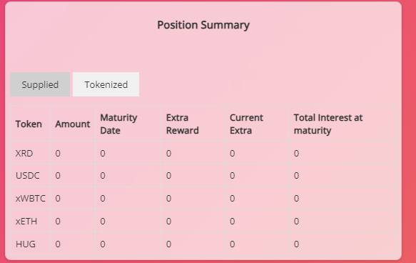

# LockOrSwap (Next step)

This application is to apply for the next Booster Grant available (5000$).

# Improvement

This is the minimum list of improvements needed to apply for the grant.

## Improvement (Major)

Scrypto
- Current Reward for suppliers needs to be token-specific (now it is the same for all the tokens)
- Current Extra-Reward for tokenizers needs to be token-specific (now it is the same for all the tokens)

Architecture
- Setup the new OCI library to fetching interest rate changes for then storing in a database
- Setup a new API (Kotlin) for serving the interest rate values (filtered by start/end epoch and resource address)
- Setup a new frontend library for showing the graph about the interest rate movement

Position Summary & Operational Panel (Frontend)
- Show tabular info about supplied/locked tokens amount
- Show graph info about locked tokens (Create and event during tokenize, store data and create API)
- 'Position Summary' and 'Operational Panel' refinement
- 'Epoch' should be converted from 'epochs' to a date
- 'Operational Panel' -> Clicking on the token should highligth the corresponding line in the table below
- 'PopUp' for each function -> Clicking on 'Supply' or 'Tokenized' or any other button should open a PopUp (//mock not ready yet)
- 'Position Summary' should highlight amount of tokens supplied and locked

Terraform
- Create (copy) terraform script for updating the website

Business
- Study Pendle, Notional whitepaper and prepare a Tokenizer whitepaper

## Improvement (Medium)

Architecture
- how to move dinamically the reward/extra reward (//not ready) based on amount supplied/locked

## Improvement (Minor)

- Suppliers should be able to add liquidity without withdrawing first

## Improvement (Future)

Architecture
- Create a function for Trade a locked position (This means burn the PT and YT and return a TKN-USDC for example, that is withdrawable directly from the platform)
- Create a function for Trade a locked indipendently a PT or a YT position 
- Create an Order Book for trading PT or YT separately

## Mock (Frontend)

Here we present a mock interface to be defined before continuing the project

Position Summary, Tab Supplied (Frontend)

  

Position Summary, Tab Tokenized (Frontend)

  

Operational Panel, Tab Supply & Withdraw (Frontend)

  

Operational Panel, Tab Tokenize & Reedem (Frontend)

  

## Current Bug

- Check the Maucalay formula

- Check what happens after a swap... PT gets returned but YT no.. is YT tradable at maturity ? a new tokenize is possible ?

- Extra amount coming from the yield claimed is not updated back as 'Liquidity Data' 
(This means that this amount remain locked in the contract) [Fixed]

- This data 'interest_for_suppliers' must be removed since it has been removed by interest_rate_changes (hashmap of avltree for all the tokens)

- This data 'extra_interest_for_suppliers' has to be used in the 'trade' function and in each 'tokenize' related function

- reward and extra_reward must be stored in an Hashmap witk resource_address as a key (this values will be duplicated in another hashmap that will contain an AVL Tree for calculating interest when accounts withdraw)

## Competitors

- Pendle 
  - Users can sell or trade these yield tokens (creates a new market for yield)
- Notional 
  - Users can lock in a fixed interest rate on their crypto until maturity (Yield is generated by liquidity providers who borrow at fixed rates, ensuring a fixed return for lenders)
- Tranche 
  - Users have the option to earn yield by depositing into either the fixed-rate Tranche A or the variable-rate Tranche B (It is integrated with other DeFi protocols and the variable returns are influenced by the underlying protocol)
- IPOR
  - It provides a reliable reference rate, essential for pricing and valuing interest rate derivatives much like what a yield curve does in TradFi
- Gearbox 
  - platform for leveraged liquid staking, also features lending pools where users lend assets and earn returns without facing IL

# Let's finally have a look at the Online demo dApp 

You can also try the deployed dApp here https://zerocollateral.eu/
