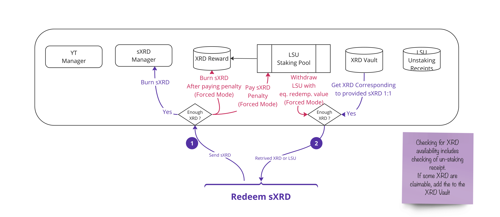
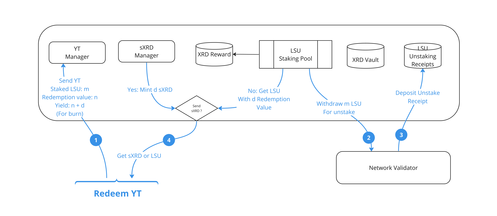

# **Yield Tokenizer** 


The Yield Tokenizer is a yield derivative protocol that offers the possibility to profit from the current XRD value of LSUs without losing the exposure to the yield they can generate in the future. To achieve this, the Yield Tokenizer dApp uses LSUs as input and generates two resources as output: a fungible resource, the **sXRD**, and a non-fungible one, the **Yield Token (YT)**. The sXRD is a synthetic derivative designed to have roughly the same market value as the XRD. The YT, on the other hand, represent current position in LSU and can be exchanged at any time for XRD whose value close to the yield generated by the LSUs that were used for its creation. The use of NFTs for representing yield positions allows for the support of multiple LSUs, but for the purpose of this challenge, we will consider that the LSUs come from the same validator. 

 
## System Operation

To ensure these functions, the system is structured around 3 processes:

### Minting
Minting involves the creation of sXRD and a YT. It takes LSUs as input. The amount of sXRD created corresponds to the amount of XRD exchangeable with the deposited LSUs. The YT will record the amount of sXRD paid out and will serve as a receipt to represent the share of the deposited LSUs in the total amount of deposited LSUs (similar to a staking receipt). To facilitate arbitrage operations, Minting could also accept XRD deposited in the unstaking vault and create the corresponding sXRD (more details will be provided later).


### sXRD Conversion

The sXRD presented to the system are exchanged for XRD at a 1:1 ratio. The returned XRD come from the Vault containing the XRD obtained during the YT conversion phase. If the pool does not contain enough XRD, the system will enter “forced” mode and will return a quantity of LSUs whose exchange value corresponds to the quantity of XRD to be returned. The forced mode is designed to guarantee sXRD/XRD convertibility and will involve sXRD penalty that will be distributed to the YT holders.



### Yield Token Conversion

 The conversion of YT happens in two steps. The first step involves withdrawing the LSUs corresponding to the deposited YTs and initiating an unstake. The native unstake receipt is kept within the system. The system will modify the yield receipt to account for the ongoing unstake. The second step involves claiming the native receipt once the unstake waiting period has expired. An amount of XRD will be withheld from the unstake return; this quantity corresponds to the sXRD created during the Minting phase. The withheld XRD are stored in a vault that will serve for the rapid conversion of sXRD.



### Fees 
Fees are can be levied on two occasions: At the creation of sXRD and during their conversion into XRD. The value of these fees defines a fluctuation range for the price of sXRD in XRD as they set the range around the price where arbitrage opportunities remain profitable. fees are not implemented in this submission but can easily be implemented.

## Interaction with the External System

The 1:1 convertibility with XRD of sXRD offers an opportunity for an external exchange pool between sXRD/XRD. This pool could even be subject to incentives, as it will participate in maintaining the value of sXRD at 1 XRD by offering direct arbitrage opportunities. Considering an arbitrager with an initial capital in XRD, we have the following scenarios:

If sXRD is more expensive than XRD at the external pool level, an arbitrager could deposit XRD in the Yield Tokenizer and systematically resell the obtained sXRD.

If XRD is more expensive than sXRD, the arbitrager could buy sXRD and convert them into XRD. In the situation of a lack of liquidity in XRD, they will obtain LSUs whose value will no longer depend on the value of sXRD but rather on the quantity of XRD exchangeable with these LSUs. 

## Potential added value:

The Yield Tokenizer presents an interest for two types of actors: liquidity providers and individuals looking to leverage their LSU position without compromising their exposure to the yield.

For liquidity providers, the Yield Tokenizer offers an attractive volume potential. By participating in the system as LSU providers, they can benefit from the creation of sXRD, a synthetic derivative with a market value similar to that of XRD. Moreover, the 1:1 convertibility with XRD guarantees a volume due to arbitrage activity.

For those looking to leverage their LSU position while maintaining their exposure to the yield, the Yield Tokenizer offers an attractive solution. By converting their LSUs into sXRD and receiving YTs, they can maintain part of their investment while freeing up capital for other opportunities.

## Risks

Although the Yield Tokenizer system offers attractive benefits, it also carries certain potential risks that must be considered:

Liquidity Risk: As with any financial system, the risk of a lack of liquidity is present. If the external exchange pool between sXRD and XRD is not sufficiently liquid, this could lead to difficulties in converting positions from sXRD to XRD or vice versa, which could affect users’ ability to carry out their transactions as needed.

Market Risk: Fluctuations in the price of XRD can affect the value of the created sXRD and the held YTs. If the price of XRD undergoes significant fluctuations, this could impact the value of the assets held in the Yield Tokenizer system, potentially leading to losses for investors.

However, these risks are mitigated by the fact that each sXRD in circulation corresponds to sealed LSUs or XRD.

## License

The Radix Scrypto Challenges code is released under Radix Modified MIT License.

    Copyright 2024 Radix Publishing Ltd

    Permission is hereby granted, free of charge, to any person obtaining a copy of
    this software and associated documentation files (the "Software"), to deal in
    the Software for non-production informational and educational purposes without
    restriction, including without limitation the rights to use, copy, modify,
    merge, publish, distribute, sublicense, and to permit persons to whom the
    Software is furnished to do so, subject to the following conditions:

    This notice shall be included in all copies or substantial portions of the
    Software.

    THE SOFTWARE HAS BEEN CREATED AND IS PROVIDED FOR NON-PRODUCTION, INFORMATIONAL
    AND EDUCATIONAL PURPOSES ONLY.

    THE SOFTWARE IS PROVIDED "AS IS", WITHOUT WARRANTY OF ANY KIND, EXPRESS OR
    IMPLIED, INCLUDING BUT NOT LIMITED TO THE WARRANTIES OF MERCHANTABILITY, FITNESS
    FOR A PARTICULAR PURPOSE, ERROR-FREE PERFORMANCE AND NONINFRINGEMENT. IN NO
    EVENT SHALL THE AUTHORS OR COPYRIGHT HOLDERS BE LIABLE FOR ANY CLAIM, DAMAGES,
    COSTS OR OTHER LIABILITY OF ANY NATURE WHATSOEVER, WHETHER IN AN ACTION OF
    CONTRACT, TORT OR OTHERWISE, ARISING FROM, OUT OF OR IN CONNECTION WITH THE
    SOFTWARE OR THE USE, MISUSE OR OTHER DEALINGS IN THE SOFTWARE. THE AUTHORS SHALL
    OWE NO DUTY OF CARE OR FIDUCIARY DUTIES TO USERS OF THE SOFTWARE.


## Stoketnet dApp Demo
 A Demo dApp is available here : [Demo](https://lsu-yield-tokenizer.vercel.app)

### Address

```bash
# XRD Resource Address
XRD = 'resource_tdx_2_1tknxxxxxxxxxradxrdxxxxxxxxx009923554798xxxxxxxxxtfd2jc'

# Validator (Hermes Protocol)
VALIDATOR = 'validator_tdx_2_1s0l6946a2kx33vjmuuh3qrax3ueauznd2fc3d69md2exx29rcnjmnj'

# Validator Liquid Stake Unit
LSU = 'resource_tdx_2_1th9k30slgu9uekfu42llstgcq80dx8d59hxgexe5hdaqzyp8etc2dv'

# Yield Tokenizer Package
PACKAGE = 'package_tdx_2_1pkkx9fcefqqletedgtut9w9ysm59g8eyk7f3kq3gj3crrvlk7klwpp'

# Yield Tokenizer Component
TOKENIZER = 'component_tdx_2_1crqqgn7qypmyzl3c23j9y8dflchxwgju0w0n4jwpp8tju6vvvv4ghf'

# sXRD Resource
SXRD = 'resource_tdx_2_1t4jrwk55pj5d7wztmaz6lfm5ds2c9s9sjycpfwer0fnjpndqynnuyw'

# Yield Token
YT = 'resource_tdx_2_1nf34kps7l5rh2pmhv2le9g6u8mq8e7gcsv7udks2x6ktfwrfqmwnxf'
```

### Run locally

To run the dApp locally cd into the `frontend`, install the dependencies with `npm install` (or `pnpm install` or `yarn`), start a development server:

```bash
npm run dev

# or start the server and open the app in a new browser tab
npm run dev -- --open
```

### Frontend Components

The demo dApp consists of five main components:

1. **Status Component**: 
   - Displays the available liquidity in XRD and LSU.
   

2. **Tokenize Component**: 
   - Tokenizes LSU into Yield Tokens and sXRD. The Yield Token can be used later to claim generated network emissions. If XRD is provided, the dApp will stake them to get LSU and then tokenize them.
   

3. **Mint sXRD Component**: 
   - Mints sXRD without creating a Yield Token.
   

4. **Redeem XRD Component**: 
   - Redeems XRD from the Yield Token. If there is not enough XRD, the dApp will enter "forced mode" and return a quantity of LSU equivalent to the XRD to be redeemed. The forced mode can be disabled by enabling the "Only XRD" option.
   

5. **Claim Component**: 
   - Claims generated network emissions. A list of all available Yield Tokens will be shown, allowing the user to claim XRD from the selected Yield Token.
   